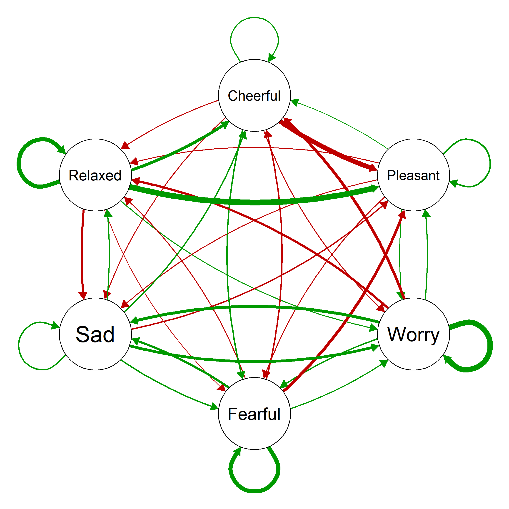

```{r setup, include=FALSE}
knitr::opts_chunk$set(echo = FALSE)
library(icons)
library(rsvg)
library(dplyr)
library(ggplot2)
```

# Introduction

## Background

- **Network theory of psychopathology**: mental disorders are characterised by consistent interactions of symptoms over time
- **Person-specific network**: visualize such temporal interactions in intensive longitudinal data
- **Vector Autoregressive (VAR) model**: the statistical model behind networks -- highly parameterized, used more for exploration than confirmation
$$
\mathbf{y_t} = \mathbf{\Delta} + \mathbf{\Phi}\mathbf{y_{t-1}} + \mathbf{\epsilon_t} \\
\mathbf{\epsilon_t}\sim \mathcal{N}(\mathbf{0}, \mathbf{\Sigma})
$$
- **Overfitting**: model estimates represent too much random noise in a sample and cannot generalize well to the population, usually caused by 
  - high model complexity and 
  - small sample size
- Our current network studies might be guilty of both
- **Predictive accuracy analysis (PAA)**: simulation-based technique used to explicitly evaluate the risk of overfitting for networks (Revol et al., 2023)

## The current study

Three main goals of the study includes: \
`r icon_style(icons::fontawesome("lightbulb", style = "solid"), fill = "#035AA6")` $~$ Applying predictive accuracy analysis to investigate the quality of person-specific networks \
`r icon_style(icons::fontawesome("crown", style = "solid"), fill = "#035AA6")` Demonstrating its usage of sample size planning for `future` single-case network studies \
`r icon_style(icons::fontawesome("crown", style = "solid"), fill = "#035AA6")` and of evaluating the risk of overfitting for networks estimated in `past` network studies \

# PAA: stepwise procedures

- Step 1. Determine simulation parameters
- Step 2. Simulate datasets:
  - **Training sets**: multiple small datasets, imitating **samples** collected from a participant
  - **Test set**: one large dataset, imitating **future unseen data** of the participant
- Step 3. Estimate networks from all training sets and make predictions for the test set
- Step 4. Calculate **squared Mahalanobis distance** as the standardized multivariate prediction error and evaluate the predictive accuracy of each network
- Step 5. Calculate **predictive accuracy probability (PAP)**:
  - The probability that an estimated network can predict future unseen data accurately
  - A threshold of PAP can be set (e.g., 80%) to judge whether the risk of overfitting for an estimated network is sufficiently low

<center>
{height=85%, width=85%}
</center>  

# Application 1: new studies

**Key question**: how many time-points in a sample are required for PAP of estimated networks to be high enough?

<center>
{height=50%, width=50%}
</center>
<!-- For this network, results are as follows: -->
<center>
{height=70%, width=70%}
</center>

# Application 2: previous studies

**Key question**: given the number of time-points in the analysis of the study, how likely is it that the estimated network did not overfit the sample?

## Standard network: Bringmann et al. (2013)

Note: Researchers of this study analyzed data of multiple participants using a multilevel approach. The following analysis is only based on data of one participant and should thus be taken with caution.

<center>
{height=70%, width=70%}
</center>

<center>
{height=70%, width=70%}
</center>

## Regualrized network: Epskamp et al. (2018)

**Regularization**: to limit spurious edges, weak edges are shrinked to 0, which results in a sparser network
<center>
{height=70%, width=70%}
</center>

<center>
{height=70%, width=70%}
</center>

# Conclusion and discussion

- Empirical network studies have **insufficient PAP** and thus are at considerable risks of overfitting.
- **Regularization** can help avoid overfitting to some extent but not necessarily to a satisfactory level. 
- **Careful sample size planning** is important. During sample size planning, other practical aspects should also be considered, for example how to handle 
  - overnight lags,
  - missing data, etc.
- **Idealistic simulation setting**: should consider potential problems when analyzing actual data, for example 
  - violations of model assumptions, 
  - potential skewness in symptom measurements, etc.

## Key reference
<!-- For a closer look at the technical details of PAA, please refer to the preprint:  -->
Revol, J., Lafit, G., & Ceulemans, E. (2023). *A new sample size planning approach for the (V)AR (1) model: Predictive Accuracy Analysis.* https://doi.org/10.31234/osf.io/2geh4

